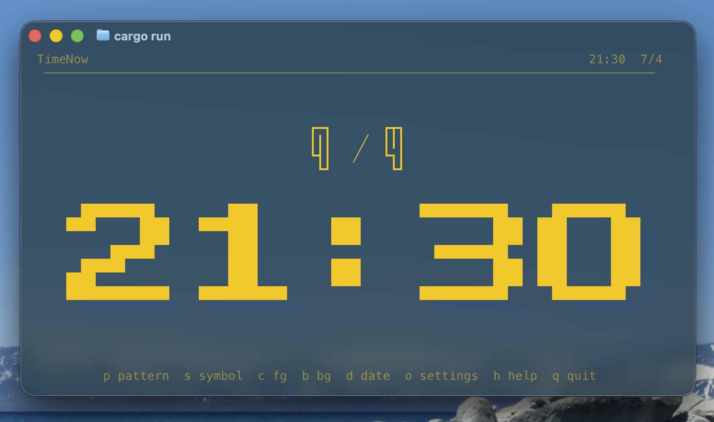

# timenow

A fullscreen terminal digital clock (HH:MM) with a blinking colon. Responsive scaling, customizable fonts/symbols/colors, and a settings modal with mouse support.



## Features

- **Fullscreen digital clock** — displays `HH:MM` in giant pixels, centered and scaled to fill the terminal
- **Blinking colon** — the colon blinks every second
- **Responsive** — automatically rescales on terminal resize
- **Customizable** — switch fonts, symbols, foreground/background colors at runtime
- **Settings modal** — full settings UI with keyboard and mouse navigation
- **Config persistence** — your preferences are saved to `~/.config/timenow/setting.json`

## Install

### Homebrew (macOS / Linux)

```sh
brew tap shogoisaji/timenow
brew trust shogoisaji/timenow   # first time only
brew install timenow
```

### Cargo

```sh
cargo install timenow
```

### Build from source

```sh
git clone https://github.com/shogoisaji/TimeNow.git
cd TimeNow
cargo build --release
# binary: target/release/timenow
```

## Usage

Run `timenow` in your terminal. Press `q` or `Enter` to quit.

### Key bindings

| Key | Action |
|-----|--------|
| `p` | Cycle font (Neo / Block / Outline / Segment) |
| `s` | Cycle symbol set (`#` / `█` / `▓░` / `*.` / `+-`) |
| `c` | Cycle foreground color |
| `b` | Cycle background color |
| `d` | Toggle date display |
| `o` | Open settings modal |
| `h` / `Esc` | Toggle help dialog |
| `q` / `Q` / `Enter` | Quit |

### Settings modal

Press `o` to open the settings modal. Navigate with:

| Key | Action |
|-----|--------|
| `←` / `→` | Switch section (Date / Pattern / Symbol / Foreground / Background) |
| `↑` / `↓` | Move cursor within section |
| `Space` | Apply selected option |
| `Click` | Click an option to apply it |
| `Enter` / `o` / `Esc` / `q` | Close modal |

## Configuration

Settings are persisted to `~/.config/timenow/setting.json`:

```json
{
  "font": "Neo",
  "symbol": "Block",
  "foreground": "Cyan",
  "background": "Black",
  "date": "Numeric"
}
```

### Options

| Field | Values |
|-------|--------|
| `font` | `Neo`, `Block`, `Outline`, `Segment` |
| `symbol` | `Hash`, `Block`, `Shade`, `StarDot`, `PlusMinus` |
| `foreground` | `Default`, `Black`, `Red`, `Green`, `Yellow`, `Blue`, `Magenta`, `Cyan`, `White` |
| `background` | `Default`, `Black`, `Red`, `Green`, `Yellow`, `Blue`, `Magenta`, `Cyan`, `White` |
| `date` | `Numeric`, `None` |

## Supported platforms

| Platform | Architecture | Binary |
|----------|-------------|--------|
| macOS | Apple Silicon (aarch64) | Yes |
| Linux | x86_64 | Yes |

Intel Mac is not supported via Homebrew. Use `cargo install` as an alternative.

## Development

```sh
cargo run              # run
cargo test             # test
cargo fmt -- --check   # format check
cargo clippy --all-targets -- -D warnings   # lint
cargo build --release  # release build
```

## License

MIT
